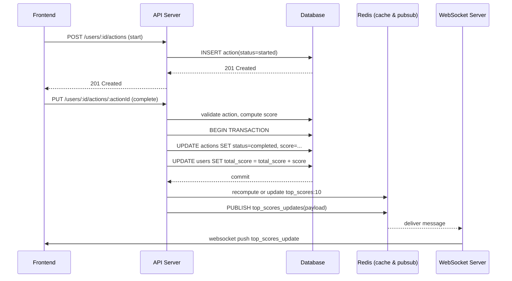

# Scoreboard Service Module

> This module provides REST APIs and a WebSocket server to support a real-time Top-10 scoreboard.

## Overview

The Scoreboard module enables storing, computing and broadcasting the top 10 users by score. It provides REST endpoints for creating and completing user actions that change scores, a REST endpoint to fetch the current top 10, and a WebSocket server to push real-time updates to connected clients.

Key properties:

* Top-10 persisted in the main database (Postgres recommended) and cached in Redis for fast reads.
* Real-time push via a dedicated WebSocket server; clients subscribe to receive top-10 update messages.
* All modifying API calls require JWT authentication and rate limiting to prevent abuse.
* Score recalculation happens when a user completes an action.

---

## API Endpoints

All request/response examples use JSON. HTTP status codes follow conventional REST practices.

### Authentication

* `POST /auth/login` — returns a JWT on successful authentication.

  * Request: `{ "username": "...", "password": "..." }`
  * Response: `{ "accessToken": "ey...", "expiresIn": 3600 }`

> Notes: JWT must be sent in `Authorization: Bearer <token>` header for protected endpoints.

### Scoreboard

* `GET /top-scores`

  * Description: Returns the top 10 users sorted by score (highest first).
  * Auth: optional for read access; if you require auth, use JWT.
  * Response: `[{ "userId": "u1", "username": "alice", "score": 12345 }, ...]`

### Action lifecycle (action = a sequence that starts and ends)

* `POST /users/:userId/actions`

  * Description: Create a new action instance (action in progress).
  * Body: `{ "status": "started", "metadata": {...} }`
  * Response: `201 Created` with created action object `{ "actionId": "a1", "status": "started", ... }`
  * Auth: required (JWT)
  * Rate limiting: apply per-user rate limiter (e.g., 10 req/min default)

* `PUT /users/:userId/actions/:actionId`

  * Description: Mark an action as completed.
  * Body: `{ "started": "completed" }`
  * Response: `200 OK`
  * Auth: required (JWT)
  * Rate limiting: stricter per-user limits for complete operations (e.g., 30/min)

> The server will recalculate the top 10 scores and emit an event through the WebSocket.

---

## Data Model

* `users` (id PK, username, email, total_score, created_at, updated_at)
* `actions` (id PK, user_id FK, type, status ENUM[started, completed, cancelled], start_at, end_at, score, metadata JSONB)
* `top_scores` (materialized table or cache backup: rank INT, user_id FK, username, score, updated_at)

Use transactions when updating `actions` and `users.total_score` together to ensure consistency.

---

## Cache Strategy (Redis)

* Store top-10 as a single Redis key, e.g. `top_scores:10` with serialized JSON and a TTL (e.g., 60s) or no TTL if updated on each score change.

* `GET /top-scores` flow:

  1. Try Redis: `GET top_scores:10`.
  2. If exists, return parsed value.
  3. If missing, query DB to compute top 10, store into Redis, return response.

* On user score update (action complete): recompute top-10 (or apply incremental update), write DB and update Redis, then notify WebSocket server.

---

## WebSocket Server

* A dedicated WebSocket server (or WebSocket functionality inside the API service) that keeps connections and pushes updates when the top-10 changes.
* Authentication during WebSocket handshake: validate JWT (e.g., `Sec-WebSocket-Protocol` header or query parameter) and reject unauthorized connections.
* Protocol: server sends messages of type `top_scores_update` with payload containing top-10 array.

Message example:

```json
{
  "type": "top_scores_update",
  "payload": [ { "userId": "u1", "username": "alice", "score": 12345 }, ... ],
  "timestamp": "2025-11-05T00:00:00Z"
}
```

> Scale considerations: Use a pub/sub channel (Redis Pub/Sub, Kafka) so multiple API instances can notify a separate WebSocket cluster. The WebSocket server instance(s) subscribe to the `top_scores_updates` channel.

---

## Detailed Flow (complete action -> notify)

1. Client authenticates and obtains JWT.
2. Client starts an action: `POST /users/:userId/actions`.
3. Client completes the action: `PUT /users/:userId/actions/:actionId`.
4. Server validates request integrity (JWT, action belongs to user, action not already completed, check anti-fraud rules) and computes score.
5. Within a DB transaction, server updates `actions` (status, awarded_points, end_at) and increments `users.total_score`.
6. Server recomputes top-10 or performs an incremental check to determine if this user's new score affects top-10.
7. If top-10 changed, server updates `top_scores` DB table and updates Redis key `top_scores:10`.
8. Server publishes update event on Pub/Sub channel (e.g., Redis `PUBLISH top_scores_updates <payload>`).
9. WebSocket server(s) receive pub/sub and push `top_scores_update` messages to connected clients.

---

## Security & Anti-Fraud

* **JWT authentication**: All modifying endpoints require valid JWT.
* **Rate limiting**: Per-user and per-IP rate limits for `POST`/`PUT` actions.
* **Idempotency & replay protection**: Use action IDs and ensure `PUT` on completed action returns 409 or no-op.
* **Monitoring & alerts**: Add anomaly detectors (sudden huge score increases, many completes from same IP) and block suspicious accounts.

---

## Concurrency, Consistency & Race Conditions

* Use DB transactions with `SELECT ... FOR UPDATE` or optimistic locking when updating user scores.
* Example: in a transaction, lock the user's row, update total_score, insert/update action, commit.
* Consider using an append-only event log for actions and a background worker to aggregate score if high throughput.

---

## Rate Limiting Suggestion

* Global: 1000 req/min per user
* Per-user: 60 req/min for create/complete action endpoints (tunable)
* Use token bucket algorithm (Redis-backed) to support distributed instances.

---

## WebSocket Scaling

* Use a cluster of WebSocket servers behind a load balancer.
* Use sticky sessions or have clients reconnect with JWT and re-subscribe.
* Use Redis Pub/Sub (or Kafka) to broadcast updates to all WS instances.

---

## Observability

* Emit events/metrics for: action.created, action.completed, score.updated, top10.changed, ws.connections, ws.messages.
* Log suspicious behaviour and failed validations separately.
* Expose Prometheus metrics and traces (OpenTelemetry) for latency and error analysis.

---

## Suggested Implementation Notes

* Language: Node.js (NestJS recommended), or any backend framework your team prefers.
* DB: Postgres for relational integrity.
* Cache: Redis for top-10 cache and pub/sub.
* WebSocket: `ws` (Node) or NestJS WebSocket gateway
* Background jobs: BullMQ (Redis) or Kafka + worker processes for heavy recompute or expensive validation.

---

## Errors and Response Codes

* `400` Bad Request: malformed payload
* `401` Unauthorized: missing/invalid JWT
* `403` Forbidden: attempting to modify another user's action
* `404` Not Found: user or action not found
* `409` Conflict: action already completed (idempotency)
* `429` Too Many Requests: rate limit exceeded
* `500` Internal Server Error

---

## Mermaid Diagrams

### Full FE -> BE action flow with real-time update



---

## Additional comments & suggestions

1. **Atomicity**: Keep action completion and user score update atomic in the same DB transaction.
2. **Immutable action records**: Keep action records append-only (mark status rather than deleting) for auditability.
3. **Testing**: Include unit tests for score calculation and integration tests for full flow including Redis and WebSocket.
4. **Backpressure**: If clients spam connects/disconnects, implement connection throttling and exponential backoff on client side.
5. **Feature flags**: Use feature flags to toggle broadcasting behavior (e.g., disable broadcast for maintenance windows).
6. **Incremental top-10 updates**: Instead of recomputing full top-10 on every completion, attempt an incremental update: check if user's new score would place them inside top-10 or displace an existing top-10 entry.
7. **Security**: Consider signing server-generated score updates (HMAC) if clients need to verify authenticity beyond TLS and JWT.

---
